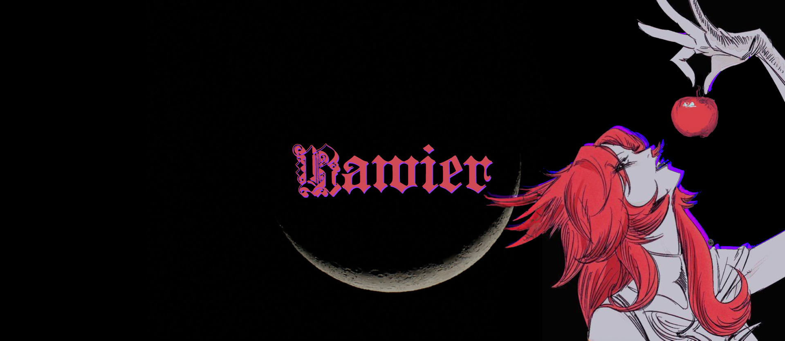

<h2 align="center">Hi 👋 is Rawier!</h2>

###

  
  

###

⚡ Music, 🔒 Cybersecurity, 🌎 Astronomy, 🧪 Science, 💼 You can see my <a href="https://rawier.vercel.app" target="blank" style="color:#52F704;">Portafolio</a> 

###

###

  
  
  
  
  
  

###

<h2 align="center">Pinned Repositories</h2>

Take a look at my most outstanding repositories.

